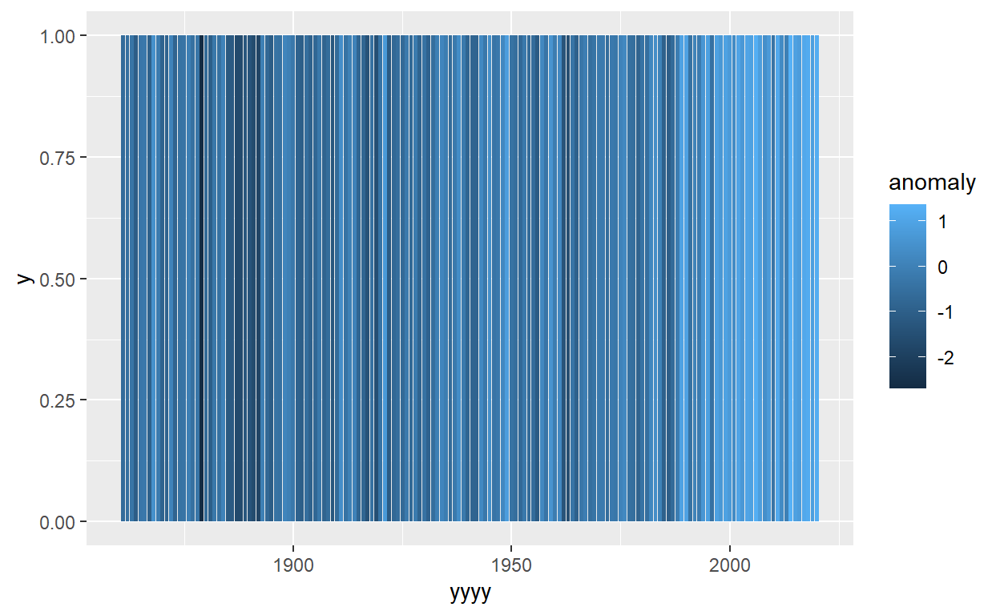
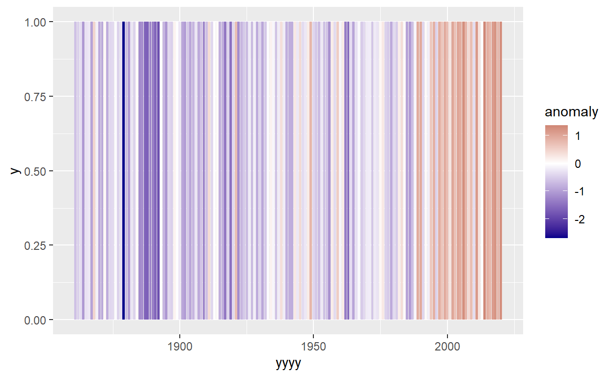
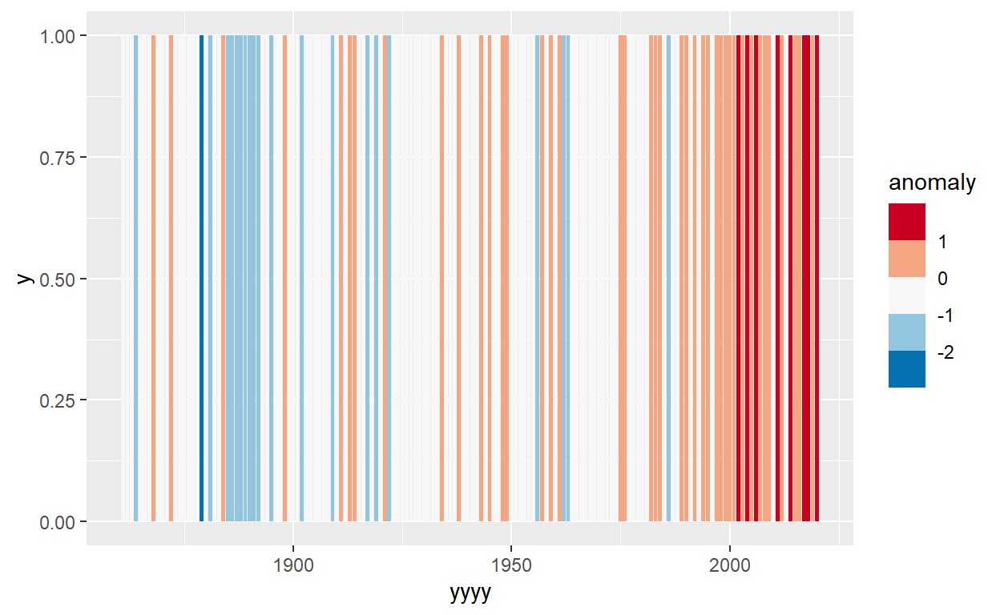
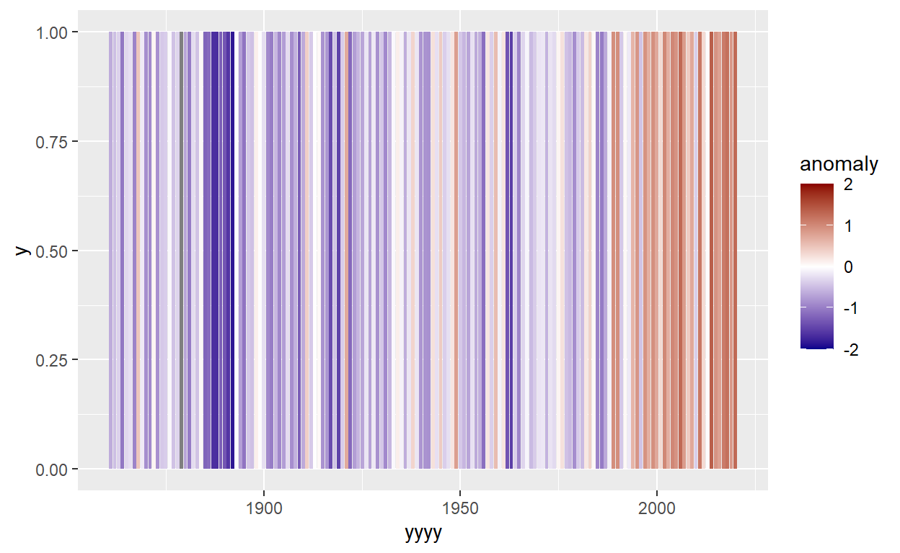
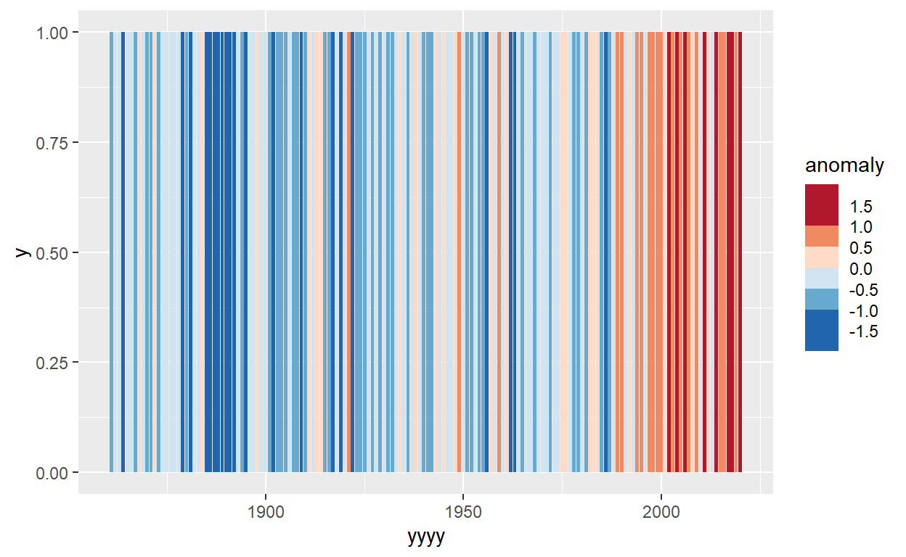
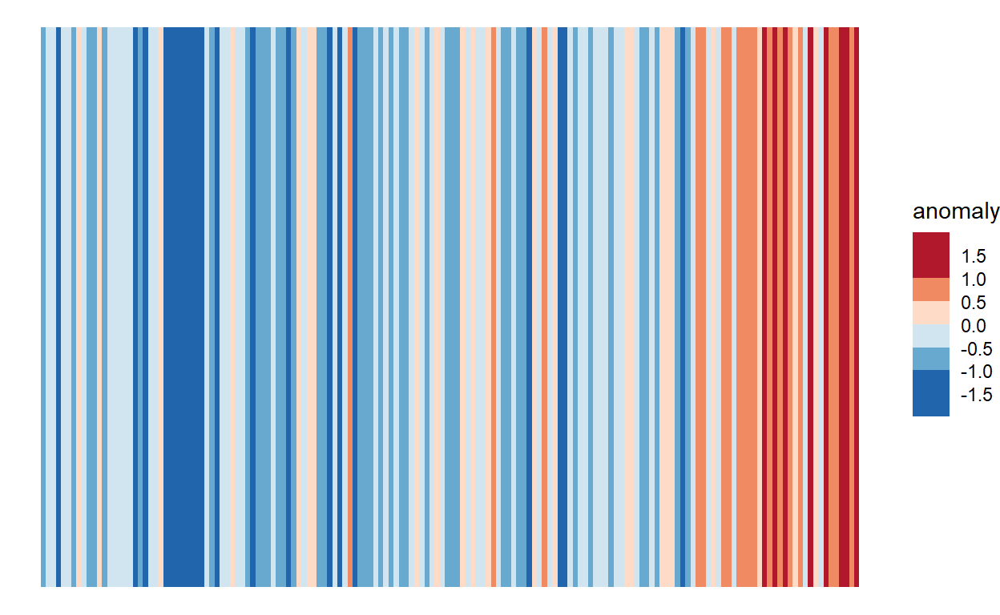
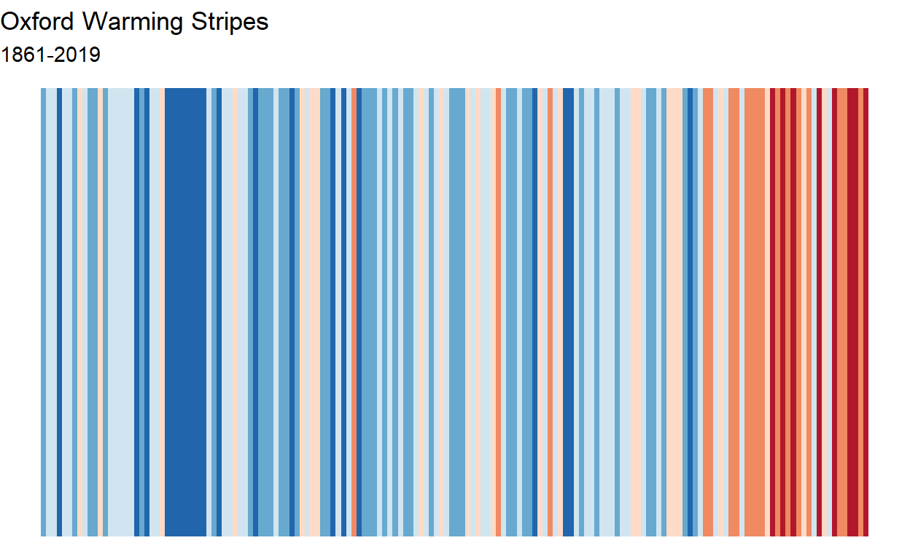

## Introduction

One of the most famous visualisations of recent times not only came from ggplot2*, but also from the University of Reading itself! 

{#id .class width=70%}

Professor Ed Hawkin's 'Warming Stripes' graph sparked huge amounts of interest, and debate, thanks to it's innovative and striking yet easily understood presentation. You can't go far on the University of Reading campus without seeing it plastered on a poster, sign or even face-mask.

If you aren't familiar with this plot, then you probably haven't been at Reading for very long, but you can read more about it here:


https://en.wikipedia.org/wiki/Warming_stripes

https://showyourstripes.info/


*(Minor side point: I believe (but may be wrong) that he used the Python implementation of ggplot2. Happy to be corrected if wrong! But the R version is better!)

It is possible to make these plots for ourselves in R, with almost identical formatting to the famous style, using only the skills we have learnt for importing data, and using `dplyr` & `ggplot`. But it will require some careful thinking and problem solving to get to that point! 

This is the solution page! If you would like to attempt this problem yourself first, please download the files from here:

And there is also a video talking through this solution here:


## Data & Methodology

We are going to use data from a weather station in Oxford, one of the longest running weather stations for which the data is easily available from the UK Met Service. 

The warming stripes show us each 'stripe' represent one years data. The colour represents the difference between the yearly average temperature and the average temperature in the reference period, 1971-2000. This is known as the temperature anomaly. We would only want to include years where we have complete data available - given the seasonality of temperatures missing values will certainly lead to biased yearly averages.

Within the plot increasingly dark shades of red represent values with an increasingly positive temperature anomaly; increasingly dark shades of blue represent an increasingly negative temperature anomaly. An anomaly of 0, or close to 0, should be shaded in white, so that the colour scale is symmetrical. 
When trying to think how it should look visually, take a look at examples of this plot from https://showyourstripes.info/ to think about what stylistic changes made be needed to the defaults within ggplot2.

## Stage 0: Load libraries

We need these `dplyr` and `ggplot2`. So let's load them in!


```r
library(dplyr)
library(ggplot2)
```


## Stage 1: Import Data

We can import the data in a fairly standard way, using read.csv, or the "import dataset" menus


```r
oxford_data<-read.csv("oxford_data.csv")
```

But if we check the data we notice that there is a problem with one of the columns.


```r
summary(oxford_data)
```

```
##       yyyy            mm              tmax           tmin          
##  Min.   :1853   Min.   : 1.000   Min.   :-0.20   Length:2011       
##  1st Qu.:1894   1st Qu.: 3.000   1st Qu.: 9.00   Class :character  
##  Median :1936   Median : 6.000   Median :13.80   Mode  :character  
##  Mean   :1936   Mean   : 6.491   Mean   :13.95                     
##  3rd Qu.:1978   3rd Qu.: 9.000   3rd Qu.:19.00                     
##  Max.   :2020   Max.   :12.000   Max.   :27.40                     
##       rain       
##  Min.   :  0.50  
##  1st Qu.: 31.45  
##  Median : 49.70  
##  Mean   : 54.70  
##  3rd Qu.: 74.75  
##  Max.   :192.90
```

We can try and find exactly whats gone wrong by looking at the data file, or looking just at the column that is causing problems.


```r
oxford_data$tmin
```

```
##    [1] "2.7"  "-1.8" "-0.6" "4.5"  "6.1"  "10.7" "12.2" "10.8" "8.4"  "7.4" 
##   [11] "2.3"  "-1.3" "1.5"  "0.6"  "2.2"  "3.5"  "5.7"  "9.7"  "11.6" "10.7"
##   [21] "8.4"  "5.6"  "2"    "2.1"  "-0.4" "-4.5" "0.1"  "2.7"  "4.9"  "9.3" 
##   [31] "13.4" "12.2" "10.4" "8.2"  "3.4"  "-0.1" "2"    "3"    "0.6"  "4.1" 
##   [41] "5.7"  "9.5"  "11.3" "12.5" "8.5"  "6.9"  "2.3"  "1.4"  "-0.6" "0.4" 
##   [51] "1.8"  "3.7"  "6.3"  "10.6" "12.7" "13.2" "11.2" "7.8"  "4.5"  "4.5" 
##   [61] "-0.1" "-1.2" "1.1"  "4"    "6.2"  "11.9" "10.6" "11.3" "11.2" "6.9" 
##   [71] "0.8"  "2.4"  "1.8"  "2.7"  "4.7"  "3.5"  "6.7"  "11.1" "13.7" "12.5"
##   [81] "9.4"  "6.6"  "1.5"  "-1.1" "0.8"  "-1.6" "1.9"  "1.7"  "7.7"  "9.5" 
##   [91] "10.3" "10.9" "7"    "7.3"  "2.1"  "---"  "-0.7" "3.1"  "3.4"  "3"   
##  [101] "6.5"  "11.2" "12"   "12.7" "9.9"  "9.5"  "1.6"  "1.5"  "2.2"  "3.4" 
##  [111] "3.9"  "6.2"  "9.2"  "9.6"  "10.6" "10.5" "9.9"  "7.6"  "0.4"  "3.8" 
##  [121] "2.5"  "2.7"  "1.9"  "4.7"  "6"    "9.6"  "9.5"  "11.9" "7.6"  "7"   
##  [131] "4.6"  "3.3"  "-0.2" "0"    "1.4"  "4.3"  "7.9"  "9.8"  "10.3" "8.8" 
##  [141] "9.4"  "6.8"  "2"    "1.3"  "-0.9" "0.2"  "-0.2" "5.4"  "8.1"  "10.8"
##  [151] "12.5" "10.8" "10.9" "6.1"  "4"    "3.4"  "3.4"  "1.3"  "1.8"  "4.7" 
##  [161] "4.8"  "11.1" "11.2" "11.3" "10.3" "8"    "3.7"  "3.3"  "-1.1" "4.4" 
##  [171] "0.5"  "6.6"  "6.8"  "9.6"  "10.5" "11.8" "9.6"  "6.3"  "1.6"  "0.1" 
##  [181] "1.7"  "3.3"  "2.9"  "4.6"  "7.8"  "9.4"  "12.7" "12.5" "9.4"  "5"   
##  [191] "2.6"  "5.2"  "3"    "5.1"  "1.1"  "6"    "6.5"  "8.8"  "12.4" "10.7"
##  [201] "11.3" "6.1"  "3.2"  "1"    "1.3"  "0.8"  "1.5"  "3.7"  "6.3"  "11.2"
##  [211] "13"   "10.6" "8.2"  "6.7"  "2.1"  "-2.3" "-1.2" "3.8"  "3.2"  "5.3" 
##  [221] "5.8"  "9"    "11.9" "12"   "9.6"  "6"    "0.2"  "0.9"  "2.6"  "4.7" 
##  [231] "3.6"  "4.5"  "5.9"  "10.2" "12.9" "11.3" "10"   "5.2"  "4.6"  "3.5" 
##  [241] "3.2"  "-0.1" "2.2"  "3.9"  "5.4"  "10.3" "11.8" "12.6" "7.8"  "4.7" 
##  [251] "3.8"  "2.1"  "3"    "1"    "3.1"  "5.4"  "6"    "9"    "11.8" "11.2"
##  [261] "10.4" "7.8"  "2.5"  "-2.3" "4.9"  "-0.4" "2.4"  "3.5"  "7.8"  "10.5"
##  [271] "11.1" "12.8" "11.4" "6.4"  "3.6"  "2.4"  "0.6"  "3"    "1.9"  "4.8" 
##  [281] "4.7"  "10"   "13.1" "11.9" "9.8"  "8.8"  "4.1"  "4.9"  "3.2"  "4"   
##  [291] "2.2"  "4.3"  "5.5"  "10.5" "11.1" "11.9" "7.6"  "5.2"  "4.3"  "2.3" 
##  [301] "2.6"  "4.2"  "2.2"  "5.5"  "8.4"  "11.1" "12.6" "13.1" "9.4"  "7.4" 
##  [311] "2.6"  "-2"   "-2.8" "1.1"  "1.1"  "2.4"  "5.2"  "10.2" "11.4" "11.8"
##  [321] "9.5"  "6"    "0.9"  "-3.2" "-2.5" "2.4"  "2.5"  "4.7"  "6.4"  "10"  
##  [331] "12.2" "13.2" "11.5" "4.9"  "3.1"  "3.6"  "-4"   "1.5"  "2.1"  "3.1" 
##  [341] "6.9"  "10.3" "12.5" "10.8" "9.5"  "4.2"  "6.9"  "2.1"  "2.8"  "3.5" 
##  [351] "4"    "5.1"  "7.3"  "9.7"  "11.9" "11.5" "8.3"  "7.2"  "3.5"  "2.5" 
##  [361] "3.3"  "4"    "-1.2" "4.5"  "7.1"  "10.1" "11.2" "11.8" "10.4" "7.4" 
##  [371] "3.3"  "2.7"  "5.1"  "3.1"  "3"    "3.1"  "6.6"  "9.9"  "12.4" "12"  
##  [381] "10.9" "6.1"  "2.6"  "2.9"  "0.9"  "3.8"  "1.2"  "3.6"  "5.3"  "9.8" 
##  [391] "11.9" "9.9"  "8.6"  "4.8"  "4"    "1.3"  "-0.5" "-1.1" "1.5"  "3.8" 
##  [401] "7"    "9.5"  "12"   "12"   "10.3" "8.7"  "3.8"  "-0.3" "-0.5" "0.5" 
##  [411] "-0.1" "1.9"  "6.1"  "10.2" "12.4" "10.5" "8.1"  "3.5"  "2.2"  "0.3" 
##  [421] "0.7"  "-0.7" "0.9"  "3"    "6.3"  "9.6"  "10.9" "10.5" "8.8"  "3.7" 
##  [431] "6"    "2.5"  "-0.1" "-0.4" "1.4"  "3.8"  "8.9"  "10.9" "11.3" "10.8"
##  [441] "9.1"  "5.4"  "4.3"  "0.1"  "3.3"  "0.3"  "2.6"  "3"    "6.6"  "9.7" 
##  [451] "11.2" "10.8" "9.9"  "5.7"  "3"    "-4"   "-1.9" "-0.2" "0.9"  "2.2" 
##  [461] "5.6"  "10.4" "10.7" "10.9" "9.8"  "6.6"  "3.2"  "1.6"  "-0.3" "0.9" 
##  [471] "-0.9" "1.7"  "6.9"  "8.7"  "10.3" "11.5" "8.9"  "4"    "3.8"  "-0.6"
##  [481] "-0.3" "2.5"  "1.7"  "3.9"  "7.7"  "10.2" "12.5" "13"   "8.9"  "6.6" 
##  [491] "1.7"  "1.3"  "1.2"  "2.2"  "2.2"  "5.1"  "5.3"  "9.9"  "12"   "11"  
##  [501] "8.3"  "6.9"  "5.4"  "2.8"  "-1.8" "-5.3" "2"    "5"    "7.3"  "9.8" 
##  [511] "12.2" "12.1" "9.9"  "3.9"  "5.4"  "1.9"  "2.4"  "1.4"  "4.3"  "5.4" 
##  [521] "6.6"  "12"   "12.1" "10.6" "10.7" "4.5"  "1.6"  "1.7"  "-0.2" "4.1" 
##  [531] "4.1"  "4.1"  "5.7"  "11.2" "12.3" "12.1" "8.9"  "6.3"  "4.3"  "1.9" 
##  [541] "4.2"  "2"    "0.6"  "3.7"  "6.8"  "9.5"  "11.1" "12.5" "10"   "8.4" 
##  [551] "4.7"  "5.1"  "2.9"  "2.1"  "0.4"  "5.1"  "6.2"  "10.3" "13.3" "12.3"
##  [561] "10.3" "4.7"  "5.4"  "-0.2" "2.1"  "0.7"  "0.9"  "3.8"  "6.3"  "10.6"
##  [571] "13.4" "11.5" "9.2"  "6.7"  "5.4"  "5"    "1"    "0.1"  "1.2"  "4.3" 
##  [581] "6.2"  "9.4"  "13.2" "11.5" "10"   "6.2"  "1.7"  "0.9"  "2.6"  "-0.5"
##  [591] "3.8"  "3.5"  "5.4"  "9.8"  "11"   "11.1" "8.5"  "6.8"  "4.5"  "2.5" 
##  [601] "2.4"  "4.5"  "4.3"  "2.6"  "7.2"  "8.9"  "11.9" "10.9" "9.7"  "8.5" 
##  [611] "3.9"  "1.6"  "1.4"  "1.5"  "1.6"  "5.4"  "7.4"  "9.2"  "13"   "11"  
##  [621] "7.9"  "6.3"  "2"    "1.6"  "0.4"  "3.2"  "3.9"  "4.5"  "6.1"  "10.9"
##  [631] "13.4" "11.4" "9.4"  "3.8"  "2.2"  "2.2"  "3.1"  "0.7"  "2.1"  "2.1" 
##  [641] "7.2"  "9.3"  "11.6" "12.6" "9.4"  "8.3"  "4.7"  "0.6"  "1.1"  "0.3" 
##  [651] "1.8"  "4.1"  "7.3"  "9.5"  "10.4" "11"   "9"    "7"    "4.2"  "3"   
##  [661] "-0.4" "2.7"  "1.5"  "2.4"  "9"    "9.8"  "12.2" "10.7" "9.4"  "8.1" 
##  [671] "5"    "1.6"  "1.1"  "-0.6" "1.2"  "3.5"  "5.4"  "8.8"  "11.7" "11.7"
##  [681] "9.1"  "8.1"  "2.3"  "1.9"  "1.6"  "2.8"  "1.9"  "4.2"  "7.3"  "11.3"
##  [691] "11.1" "12"   "9.1"  "8.5"  "0.4"  "4.7"  "1.3"  "2.4"  "2.7"  "4.2" 
##  [701] "8.4"  "10.5" "13.1" "14"   "9.4"  "6.7"  "3.6"  "4.6"  "1.7"  "3.7" 
##  [711] "5"    "3.8"  "8.8"  "10.2" "12.5" "10"   "7.7"  "3.9"  "4.1"  "5"   
##  [721] "3"    "1.9"  "3.3"  "4.7"  "7.8"  "10"   "11.4" "11.1" "10.8" "8.5" 
##  [731] "5.7"  "2.8"  "1.2"  "3.8"  "3.3"  "4.7"  "6.4"  "10"   "12.2" "12.1"
##  [741] "8.3"  "7.2"  "4"    "2.6"  "2.2"  "1.9"  "1.8"  "3.5"  "6.4"  "9.5" 
##  [751] "11.3" "12.2" "8.6"  "6.3"  "0.1"  "3.5"  "5.1"  "1.1"  "1.1"  "4.3" 
##  [761] "7.6"  "8.1"  "11"   "12.6" "9"    "8.2"  "3.8"  "-0.6" "0.1"  "-1.4"
##  [771] "0"    "1.8"  "8.2"  "10.8" "11.9" "12.7" "10.8" "4"    "5.3"  "-0.7"
##  [781] "1.3"  "3.9"  "2.1"  "3.6"  "8"    "8.5"  "11.7" "12"   "9"    "6.4" 
##  [791] "2.1"  "5"    "0.6"  "-1"   "1"    "3.3"  "7.8"  "9.7"  "10.2" "12"  
##  [801] "8.7"  "2.3"  "1"    "3.2"  "2.8"  "2.7"  "3.8"  "5.9"  "7.8"  "10.1"
##  [811] "11"   "9.7"  "9.3"  "6.6"  "3.4"  "2.2"  "5.2"  "1.4"  "4.1"  "3.9" 
##  [821] "6.9"  "9.5"  "13.3" "12.1" "9.3"  "8.2"  "1.7"  "3.6"  "1.3"  "1.4" 
##  [831] "1.8"  "1.9"  "8.1"  "9.3"  "10.4" "10.1" "8.8"  "4"    "2.3"  "3.9" 
##  [841] "2.2"  "3.7"  "3.6"  "4.3"  "6"    "8.8"  "13.5" "11.1" "8.5"  "7.1" 
##  [851] "0"    "1"    "3"    "0.4"  "-0.2" "3.7"  "8"    "10.4" "10.9" "10.5"
##  [861] "10.5" "7.3"  "4.8"  "4.3"  "2.3"  "2.5"  "1.5"  "3.6"  "7.8"  "9.9" 
##  [871] "12.3" "12"   "7.8"  "6.9"  "1.4"  "0.4"  "1.5"  "4.7"  "3.3"  "5.2" 
##  [881] "6.6"  "9.4"  "12.9" "12.1" "11"   "4.5"  "3.6"  "1.3"  "1.8"  "1.3" 
##  [891] "4.4"  "4.5"  "6.8"  "8.8"  "12.6" "12.2" "9.6"  "6.8"  "3.5"  "0.3" 
##  [901] "2.2"  "2.2"  "3.4"  "4.5"  "6.4"  "9.1"  "12.4" "11.7" "7.9"  "6.8" 
##  [911] "4.6"  "0.4"  "-1.1" "-3"   "-0.1" "2.5"  "6.4"  "8.9"  "11.2" "11.6"
##  [921] "10.7" "6.3"  "3.3"  "3.4"  "3.4"  "0.3"  "1.8"  "5"    "7"    "10.8"
##  [931] "11.7" "12"   "10.5" "7.5"  "2.8"  "1.9"  "0.8"  "1.3"  "0.3"  "4.7" 
##  [941] "7.8"  "11"   "12.1" "11.2" "8.3"  "5.2"  "5.1"  "2.8"  "3.5"  "-0.4"
##  [951] "0.4"  "3.8"  "7.5"  "9.5"  "12.7" "13.6" "9.7"  "5.9"  "4"    "3.5" 
##  [961] "-0.7" "1.4"  "3.3"  "4.5"  "8.1"  "10.6" "13.6" "12.7" "10.7" "6.7" 
##  [971] "2.8"  "-0.7" "0.6"  "-0.5" "1.3"  "4.5"  "6.9"  "10.6" "12.9" "11.4"
##  [981] "10.7" "7.6"  "3.9"  "5.9"  "2.5"  "2.9"  "2.8"  "4.4"  "5.4"  "11.2"
##  [991] "12.7" "12.1" "10.2" "6.1"  "4.3"  "0.9"  "1.7"  "-0.3" "4.1"  "2.9" 
## [1001] "6.8"  "10.6" "12"   "11.7" "11.3" "5.2"  "2.2"  "2.2"  "2.5"  "3.5" 
## [1011] "0.8"  "5.8"  "8.2"  "10"   "12.6" "12.5" "9.1"  "7.2"  "1.6"  "0.7" 
## [1021] "3.4"  "2"    "4.3"  "2.5"  "6.5"  "10.8" "11.7" "12.6" "10.1" "7.1" 
## [1031] "6.9"  "1.5"  "2.3"  "2.8"  "2.8"  "4.9"  "7.3"  "9.7"  "12.1" "12.4"
## [1041] "10.8" "5.2"  "6.5"  "0.6"  "-4.6" "0.2"  "2.5"  "5"    "7.8"  "11.1"
## [1051] "11.1" "11.1" "8.6"  "6"    "4.3"  "0.8"  "-1.2" "1.3"  "1.4"  "3.1" 
## [1061] "5"    "10.9" "13.1" "11.3" "10.4" "6.4"  "4.2"  "2.7"  "-2"   "-2.6"
## [1071] "1.9"  "5.1"  "6.8"  "9.5"  "11.8" "12.8" "10"   "7.3"  "1.9"  "4.7" 
## [1081] "2.9"  "2.7"  "2.2"  "6.9"  "7.7"  "10.3" "11.9" "12.4" "9.2"  "6.8" 
## [1091] "3.1"  "0.7"  "3"    "0.9"  "1.2"  "6.1"  "6.5"  "9.6"  "13.1" "13"  
## [1101] "8.6"  "6.6"  "3.6"  "0.8"  "-2"   "4.7"  "3.9"  "5.6"  "8.2"  "10.8"
## [1111] "12.8" "11.7" "11.5" "8"    "4.4"  "2.5"  "0.1"  "4"    "1.3"  "5"   
## [1121] "6.2"  "9.5"  "12.7" "11.4" "11"   "7.1"  "5.7"  "-0.1" "-0.6" "-4.4"
## [1131] "1.3"  "5.2"  "9"    "11.4" "13.6" "13.1" "11.1" "5.6"  "4.6"  "2.8" 
## [1141] "3.2"  "2.2"  "3.5"  "4.4"  "6.5"  "9.9"  "12.1" "11.9" "10.7" "6.4" 
## [1151] "4.2"  "3.4"  "3.1"  "1.6"  "1.7"  "6.1"  "6.6"  "10.3" "12.8" "12.6"
## [1161] "12.5" "8.4"  "3.4"  "3.3"  "1.5"  "2.8"  "3.6"  "4.2"  "7.1"  "11.8"
## [1171] "12.5" "12.2" "10"   "6.6"  "4"    "-0.7" "2"    "1.4"  "1.6"  "2.9" 
## [1181] "6.5"  "9.4"  "12.1" "11.7" "10.7" "5"    "6.2"  "3"    "0.3"  "0.3" 
## [1191] "3.9"  "5.4"  "9.5"  "10.5" "12.9" "12.6" "7.2"  "5.6"  "1.3"  "-0.6"
## [1201] "0.8"  "1.1"  "0.3"  "3.5"  "8.2"  "10.5" "11.7" "12.2" "10"   "6.5" 
## [1211] "5.9"  "5"    "0.3"  "0.2"  "2.9"  "2.8"  "7.2"  "10.3" "11.3" "11.3"
## [1221] "9.4"  "9.3"  "3.8"  "4.4"  "0.3"  "-1.1" "-0.4" "5.6"  "6"    "10.1"
## [1231] "12.6" "13.6" "10"   "5.4"  "3.7"  "2.2"  "1"    "-3.5" "2.2"  "2.6" 
## [1241] "7.1"  "9.6"  "12.5" "10.6" "11.1" "5.8"  "2.9"  "3.5"  "3"    "3.2" 
## [1251] "5.9"  "5.1"  "6.2"  "10.1" "13.4" "12.1" "9.7"  "7.6"  "3.7"  "1.6" 
## [1261] "1"    "2.3"  "0.9"  "3.6"  "7.9"  "10.7" "12.3" "12.7" "11.8" "8.1" 
## [1271] "4.2"  "2.7"  "-0.6" "1.3"  "4.1"  "6.3"  "7.7"  "10.9" "12.8" "13"  
## [1281] "9.4"  "7.8"  "3.7"  "3.4"  "1.6"  "1.9"  "3.9"  "4.8"  "8.8"  "11.9"
## [1291] "11.9" "11.4" "9.8"  "7.9"  "4.7"  "2.2"  "1.8"  "4.9"  "3.7"  "7"   
## [1301] "7.2"  "10.2" "11.9" "12"   "11.5" "7.5"  "3.1"  "-0.3" "1.6"  "1.6" 
## [1311] "-0.7" "4.5"  "7"    "9.3"  "11.8" "11.6" "9.5"  "6.8"  "2.8"  "-1.6"
## [1321] "-5.8" "-3.1" "3.1"  "5.7"  "6.9"  "11"   "11.4" "11.2" "9.7"  "8.4" 
## [1331] "6.3"  "0"    "1.1"  "2.5"  "2.1"  "5.6"  "9.3"  "10.7" "12.7" "11.8"
## [1341] "9.6"  "4.9"  "5"    "0.7"  "1.2"  "0.5"  "1.8"  "4.5"  "8.4"  "10.8"
## [1351] "11"   "11"   "9.1"  "7"    "1.9"  "2.4"  "0.8"  "4.6"  "3.2"  "5"   
## [1361] "7.2"  "11.3" "11.7" "11.1" "10.3" "7.9"  "2.9"  "3"    "2.6"  "2.9" 
## [1371] "4.2"  "4.7"  "7.5"  "9.9"  "13.1" "12.3" "10.9" "8.8"  "3"    "2"   
## [1381] "2"    "-0.1" "3.6"  "4.4"  "6.7"  "11.4" "12"   "12.3" "11.1" "10.6"
## [1391] "4.6"  "1.1"  "3.6"  "-0.9" "1.1"  "3.7"  "8.3"  "9.5"  "13.1" "13.2"
## [1401] "10.8" "9.9"  "3.2"  "1.2"  "1.9"  "0.6"  "0.6"  "3.8"  "8.7"  "11.6"
## [1411] "11.9" "12.2" "11.2" "7.4"  "5.6"  "1.8"  "2.5"  "1.5"  "2.2"  "4.3" 
## [1421] "7.4"  "9.4"  "13.1" "12.7" "9.8"  "7.4"  "3"    "4.6"  "2"    "2.5" 
## [1431] "2.8"  "5.4"  "7.4"  "8.8"  "11.8" "11.6" "8.3"  "7.4"  "3.8"  "3.5" 
## [1441] "2.1"  "1.3"  "2.1"  "4.2"  "8.1"  "10.9" "12.2" "12.8" "11"   "5.5" 
## [1451] "3.2"  "2.3"  "3.6"  "3.1"  "2.4"  "3.8"  "6.8"  "10.1" "12.2" "11.3"
## [1461] "9.1"  "4.9"  "5"    "5.9"  "4.6"  "1.8"  "2.5"  "5.3"  "6.4"  "9.4" 
## [1471] "13.4" "14.1" "9.9"  "6.5"  "2.5"  "1.7"  "3.4"  "2.3"  "1.7"  "4.1" 
## [1481] "8.3"  "12.6" "13.2" "11.4" "10.5" "8.3"  "3.4"  "-0.4" "0.7"  "3.3" 
## [1491] "4.3"  "3.8"  "6.1"  "8.5"  "12"   "12.2" "10.4" "8.3"  "3.8"  "3.9" 
## [1501] "0.7"  "0.4"  "3.3"  "3.3"  "7.1"  "9.6"  "11.5" "11.4" "10.6" "8.1" 
## [1511] "5.5"  "2.2"  "-3.1" "-0.9" "2.1"  "4.8"  "6.8"  "10.7" "13"   "11.7"
## [1521] "9.6"  "8"    "3.9"  "3.8"  "-0.3" "3.2"  "2.3"  "4.9"  "6.3"  "10.7"
## [1531] "11.2" "12.8" "12.2" "6"    "4.4"  "2.9"  "2.4"  "0.2"  "6.4"  "4.4" 
## [1541] "8.2"  "10.4" "12.3" "12.7" "11"   "5.7"  "4.9"  "-2"   "-0.1" "2.7" 
## [1551] "2.9"  "4.9"  "7.2"  "12.7" "12.8" "12.9" "10.6" "7.8"  "6.1"  "1.9" 
## [1561] "4.7"  "-0.7" "3.3"  "3.7"  "7.8"  "11"   "15.4" "13.3" "11.1" "7.7" 
## [1571] "5.2"  "3.2"  "1.5"  "1"    "2.4"  "3.4"  "6"    "10.8" "12.2" "13.6"
## [1581] "11.2" "8.6"  "6"    "2.7"  "-1.9" "-0.8" "1.4"  "5.1"  "7.3"  "9"   
## [1591] "12.7" "12.1" "11.2" "7.9"  "1.7"  "5.1"  "1.1"  "-4.1" "2.1"  "3.1" 
## [1601] "8"    "10.5" "12.8" "11"   "7.5"  "7.8"  "5.4"  "3.8"  "-1.4" "1"   
## [1611] "1.5"  "6.6"  "6.5"  "10.4" "12.7" "12.5" "10.9" "6.7"  "4.3"  "3.7" 
## [1621] "3.3"  "2.3"  "3.8"  "4.6"  "7.8"  "10.3" "11.6" "11.9" "10.4" "8"   
## [1631] "1.6"  "5.4"  "3.6"  "3"    "4.6"  "3.6"  "8.6"  "10.5" "14"   "12.4"
## [1641] "11.9" "8.9"  "3.2"  "3.3"  "4.5"  "5.3"  "5"    "3.3"  "7.8"  "10.7"
## [1651] "12.2" "14"   "9.4"  "9.3"  "4.3"  "1.7"  "1.2"  "-1.6" "5.1"  "4.6" 
## [1661] "7.4"  "9"    "13.7" "13.3" "10.6" "7.3"  "4.5"  "1.6"  "1.5"  "2.1" 
## [1671] "4.8"  "5.6"  "9.1"  "11.7" "13.5" "12.8" "10.8" "5.2"  "4.7"  "1.3" 
## [1681] "3.5"  "2.4"  "3.9"  "6.6"  "8"    "11.5" "12.3" "11.1" "9.3"  "6"   
## [1691] "2.6"  "3.4"  "3.3"  "1.3"  "5.3"  "5.1"  "7.6"  "11"   "13.8" "13"  
## [1701] "10.4" "6.9"  "8.4"  "3.9"  "2.2"  "4.4"  "2"    "5.4"  "7.8"  "10.4"
## [1711] "13.9" "13.9" "10.3" "10.3" "5.2"  "0.2"  "3.1"  "-0.1" "1.8"  "4.8" 
## [1721] "5.6"  "10.2" "12.7" "12.5" "10.3" "8.6"  "2.9"  "0.9"  "-0.2" "4.2" 
## [1731] "5.5"  "4.9"  "7.4"  "11.3" "12.9" "15.7" "10.7" "6.6"  "6.1"  "3.6" 
## [1741] "2.9"  "4.1"  "5.4"  "5.1"  "9.1"  "11.5" "12.4" "11.9" "11.8" "8.2" 
## [1751] "2.2"  "3.2"  "3.4"  "2.9"  "4.8"  "6.1"  "9.7"  "10.1" "13.3" "12.9"
## [1761] "12.4" "7.1"  "5.3"  "1.7"  "2"    "3.8"  "4.2"  "4.8"  "8.6"  "12.2"
## [1771] "12.3" "13.3" "12.1" "8.2"  "4.8"  "4.2"  "1.2"  "2"    "3.1"  "4.8" 
## [1781] "7.9"  "10.6" "13.4" "12.9" "10.5" "11.1" "3.9"  "0.2"  "3.4"  "4.4" 
## [1791] "4.6"  "5.2"  "8.4"  "10.3" "12"   "12.9" "10"   "7.1"  "6.4"  "4.1" 
## [1801] "1.8"  "0.6"  "2.7"  "4.6"  "8.1"  "11.8" "13.4" "13.5" "8.1"  "3.9" 
## [1811] "5.7"  "1.8"  "2.7"  "2.9"  "3.4"  "6.2"  "8.6"  "12"   "12.2" "14.2"
## [1821] "11.7" "8.6"  "5.8"  "2.8"  "3.8"  "2.1"  "4.7"  "5.7"  "7.6"  "12"  
## [1831] "13.4" "12.2" "11.9" "10.9" "3.1"  "1.8"  "2.2"  "0.8"  "2"    "5.4" 
## [1841] "9"    "11.7" "14.9" "13.1" "13.5" "10.6" "5.1"  "4.3"  "4.8"  "3.7" 
## [1851] "3.7"  "5.6"  "7.1"  "11.3" "12.2" "12"   "10.3" "7.9"  "4.3"  "2.4" 
## [1861] "4.7"  "1.7"  "3.5"  "4.7"  "9.5"  "11.1" "12.8" "13.9" "10.2" "5.7" 
## [1871] "4.8"  "1.3"  "0.2"  "2"    "3.2"  "6.1"  "8.3"  "10.7" "13.1" "13.3"
## [1881] "10.6" "8.4"  "7"    "0.8"  "-1"   "1.3"  "3.2"  "4.9"  "7.3"  "11.1"
## [1891] "14.2" "12.1" "10.3" "7.4"  "2.9"  "-2.2" "1.9"  "4.4"  "3.2"  "7.3" 
## [1901] "8.4"  "10.2" "10.2" "11.4" "10.7" "9.5"  "6.3"  "3.1"  "3.6"  "1.2" 
## [1911] "3.6"  "4.6"  "9.7"  "11.6" "12.6" "13.6" "9.2"  "7.1"  "4.2"  "2.6" 
## [1921] "1.9"  "0.9"  "0.2"  "3.9"  "6.7"  "10.2" "13.9" "13.1" "9.9"  "9.9" 
## [1931] "3.8"  "3.6"  "3.5"  "4.2"  "3.5"  "6.4"  "8.9"  "11.8" "13.5" "11.7"
## [1941] "11.4" "9.9"  "5.7"  "2.4"  "1.6"  "1"    "3.3"  "4.5"  "7.7"  "10.2"
## [1951] "12.5" "13"   "8.9"  "7.9"  "7.3"  "8.3"  "3"    "2.7"  "2.2"  "4"   
## [1961] "8.7"  "11.9" "13.8" "13.6" "13"   "7.3"  "3.3"  "3"    "0.8"  "4"   
## [1971] "5.8"  "4.7"  "9.4"  "12.9" "13.9" "12.6" "10.4" "9.7"  "3.8"  "2.6" 
## [1981] "3"    "0.3"  "2.5"  "7.5"  "8.6"  "11.6" "14.2" "13.2" "10"   "7.3" 
## [1991] "5.5"  "4.7"  "1.3"  "2.4"  "5.2"  "4.3"  "7"    "11"   "13.9" "13.2"
## [2001] "10.4" "7.5"  "4.3"  "3.7"  "4.5"  "4.2"  "3"    "5.5"  "7.9"  "12.1"
## [2011] "13"
```

There is a missing value in this data. But rather unpleasantly it has been coded as "---", which means the `tmin` column is being treated not as a number but as a string.

Thankfully there is an argument we can find within `read.csv` that allows for custom NA values. This also exists within the "Import Dataset" menu.


```r
oxford_data<-read.csv("oxford_data.csv",na.strings = "---")
```

Again, we should double check to see if the data has been read in appropriately.


```r
summary(oxford_data)
```

```
##       yyyy            mm              tmax            tmin      
##  Min.   :1853   Min.   : 1.000   Min.   :-0.20   Min.   :-5.80  
##  1st Qu.:1894   1st Qu.: 3.000   1st Qu.: 9.00   1st Qu.: 2.80  
##  Median :1936   Median : 6.000   Median :13.80   Median : 5.60  
##  Mean   :1936   Mean   : 6.491   Mean   :13.95   Mean   : 6.22  
##  3rd Qu.:1978   3rd Qu.: 9.000   3rd Qu.:19.00   3rd Qu.:10.20  
##  Max.   :2020   Max.   :12.000   Max.   :27.40   Max.   :15.70  
##                                                  NA's   :1      
##       rain       
##  Min.   :  0.50  
##  1st Qu.: 31.45  
##  Median : 49.70  
##  Mean   : 54.70  
##  3rd Qu.: 74.75  
##  Max.   :192.90  
## 
```

And this time it looks better!

##  Stage 2: Manipulate Data

Before going any further we should consider the structure of our data as it is now, and the structure of the data we need to be able to make a plot.

Right now the data we have is:

* One row per month  
* Two columns for temperature (tmax and tmin)  


The data we need for the plot would have:

* One row per year  
* One column for temperature anomaly   


So there are going to be quite a few steps needed here to get from A to B. We definitely want to try to work these out in advance before writing the code. Some people would find it useful to draw a diagram which might help think about what order the steps should be in.

There are broadly 5 steps needed. Some of these could be re-ordered and it would still be valid, but this is the order that made the most sense to me

2.1: Calculate a single monthly average temperature value - based on tmax and tmin values

2.2: Calculate the average temperature from within the reference period - this will be a single constant value

2.3: Grouping by year and then obtaining annual averages of the average temperatures

2.4: Calculate the temperature anomaly for each year 

2.5: Remembering from what we found out in Stage 1 (Data Importing) - filtering to a sensible range of years with complete data


### 2.1 Calculate a single monthly average temperature value - based on tmax and tmin values

To get the monthly average we will need to take the average of the tmax and tmin column. 
This is not a perfect method for obtaining average temperatures; see: https://journals.ametsoc.org/jamc/article/58/10/2235/343374/A-Significant-Bias-of-Tmax-and-Tmin-Average
But it is the easiest and very commonly used given the availability of data.

We have seen many examples so far about how calculate average values from within a column from multiple rows. However in this case we need to taking an average of values from multiple *columns*.

This is a little trickier to do, the easiest way is to simply go back to first principles and remember the formula for calculating a mean - add all the values, then divide the sum by the number of values. I can do this using `mutate()` to create a new column called `tmean`.


```r
oxford_data<-
  oxford_data %>%
    mutate(tmean=(tmin+tmax)/2)
```
I am also going to over-write the existing object at this point by assigning the output to be an object called `oxford_data`. Since step 2.2 will not be inside a continuous pipe (although in the video solution, I did use a slightly more complicated method to do everything within a single pipe. The code for that alternative is included at the end of this solution.)

### 2.2: Calculate the average temperature from within the reference period

From the updated data created in 2.1, I will filter to just the years 1971-2000 and then get the mean value.


```r
refmean=oxford_data %>%
  filter(yyyy>=1971 & yyyy<=2000) %>%
    summarise(mean=mean(tmean))
```


### 2.3: Grouping by year and then obtaining annual averages of the average temperatures

Using `group_by` and `summarise` I can now calculate mean values for each year. Remember there was one missing value in our dataset. Because of the seasonality of temperature, if we use `na.rm=T` when calculating the mean temperature for the year, we will definitely have a biased estimate of the mean. Therefore it is probably safer to not use this option for calculating the mean, and leaving the mean for this year as an NA. 


```r
oxford_data %>%
  group_by(yyyy) %>%
    summarise(tmean=mean(tmean))
```

```
## `summarise()` ungrouping output (override with `.groups` argument)
```

```
## # A tibble: 168 x 2
##     yyyy tmean
##    <int> <dbl>
##  1  1853  8.97
##  2  1854  9.69
##  3  1855  8.83
##  4  1856  9.53
##  5  1857 10.3 
##  6  1858  9.50
##  7  1859 10.1 
##  8  1860 NA   
##  9  1861  9.76
## 10  1862  9.90
## # ... with 158 more rows
```

### 2.4: Calculate the temperature anomaly for each year 

Finally we can calculate the temperature anomaly by subtracting the yearly averages from the 20th century average


```r
oxford_data %>%
  group_by(yyyy) %>%
    summarise(tmean=mean(tmean)) %>%
        mutate(anomaly=tmean-refmean$mean)
```

```
## `summarise()` ungrouping output (override with `.groups` argument)
```

```
## # A tibble: 168 x 3
##     yyyy tmean anomaly
##    <int> <dbl>   <dbl>
##  1  1853  8.97  -1.42 
##  2  1854  9.69  -0.699
##  3  1855  8.83  -1.56 
##  4  1856  9.53  -0.853
##  5  1857 10.3   -0.116
##  6  1858  9.50  -0.891
##  7  1859 10.1   -0.291
##  8  1860 NA     NA    
##  9  1861  9.76  -0.628
## 10  1862  9.90  -0.482
## # ... with 158 more rows
```

Note that, even though there is only one value in the data frame `refmean` we still need to refer to the column name to access this value. 


### 2.5 Filtering to a sensible range of years with complete data

Because of the missing value in 1860, then it probably makes sense to only plot the years we have complete data for. So let's restrict the plot to only 1861 and onwards.


```r
oxford_plot_data<-
  oxford_data %>%
  group_by(yyyy) %>%
    summarise(tmean=mean(tmean)) %>%
        mutate(anomaly=tmean-refmean$mean)%>%
          filter(yyyy>=1861)
```

```
## `summarise()` ungrouping output (override with `.groups` argument)
```

Now that I have completed my data manipulation steps I also decide to assign this into a new object called `oxford_plot_data`.

We are now ready to make our plot!

## Stage 3: Plotting

### Make the initial plot

Let's deconstruct the plot structure to understand more how it works. 

* We have year on the x axis  
* A coloured 'stripe' for each year, (a bar of constant height)   
* The colour represents the anomaly  

So within `ggplot2` our solution will be

* Map `yyyy` to the x axis  
* Map `anomaly` to the fill axis  
* The variable going onto the y axis should not be a variable at all! We want a constant, so we can just set this to be an arbitrary value. We do need to set this to be equal to some value, so R knows how high to make each bar  
* Use`geom_col` not `geom_bar`, because we are setting the heights of the bars, rather than using bars to summarise counts, or other statistics, from data

This gives us:

```r
ggplot(data=oxford_plot_data,aes(x=yyyy,y=1,fill=anomaly))+
  geom_col()
```



Not a bad start!

Now we need to think about how to format this into the classic 'warming bars' style. There are a few things we need to do:

1. Change the colour palette so that low values are blue and high values are red and zero is white  
2. Make the colour scale 'symmetrical'. You can see from the legend that the zero value is not in the middle of scale.  
3. Remove the small spaces between bars  
4. Remove all the gridlines, axis labels, and backgrounds  

### 3.1 Colour Palette

This is where we will need to use a `scale_` function, to modify the way the colours are allocated. There are a few different scale functions for creating colour gradients depending on whether you need a single colour gradient, a double colour gradient or a n-level colour gradient. In this particular case we need a double gradient - because we want to set negative values to go from dark blue up to white (at zero). Then from zero we want an additional gradient to go from white to dark red as numbers become more positive. So the function we need is `scale_fill_gradient2`. In this we need to set the colour values for our "low", "mid" and "high" extremes of colour. 


```r
ggplot(data=oxford_plot_data,aes(x=yyyy,y=1,fill=anomaly))+
  geom_col()+
    scale_fill_gradient2(low = "darkblue",mid="white",high="darkred")
```



An alternative, and probably better, option is to use the new function `scale_fill_fermenter()`which works in a similar way to `scale_fill_brewer()` except with continuous variables being used to set colours instead. This is nice because the "RdBu" colour palette from colour brewer is exactly the colour palette used in the warming stripes plots.


```r
ggplot(data=oxford_plot_data,aes(x=yyyy,y=1,fill=anomaly))+
  geom_col()+
    scale_fill_fermenter(palette="RdBu")
```




### 3.2 Symmetrical colour scale

A little suprisingly, because of the default options within `scale_fill_gradient2`, we now do have a symmetrical colour palette! The function defaults to a midpoint of zero, and stretches the colour assignments so that they are symmetrical. You can't tell this from just looking at the plot, but the top level of 'reds' being plotted is not at the full extent of 'darkred' unlike the blue which does extend as far as possible. If we did want to make sure of this explicitly we could set the limits within the scale call, exactly as we might modify the limits of an x or y axis as we have seen previously.


```r
ggplot(data=oxford_plot_data,aes(x=yyyy,y=1,fill=anomaly))+
  geom_col()+
    scale_fill_gradient2(low = "darkblue",mid="white",high="darkred",limits=c(-2,2))
```




The plot is identical, but you can see the darkest red in the legend is now a bit darker!

Within `scale_fill_fermenter` thought this is not automatic - so we would need to explicitly set limits.


```r
ggplot(data=oxford_plot_data,aes(x=yyyy,y=1,fill=anomaly))+
  geom_col()+
    scale_fill_fermenter(palette="RdBu",limits=c(-1.5,1.5))
```




### 3.3 Removing spaces

It may not be obvious without zooming in, but there are small spaces between each bar. This is because by default R sets bars to fill 95% of the width available, and leave 5% spacing between bars. However no such spaces exist in the 'classic' warming stripes. Thankfully this is easy to resolve by adding the option width=1 into geom_col.


```r
ggplot(data=oxford_plot_data,aes(x=yyyy,y=1,fill=anomaly))+
  geom_col(width=1)+
    scale_fill_fermenter(palette="RdBu",limits=c(-1.5,1.5))
```


### 3.4 Removing labels, gridlines etc.

With the `theme()` function we can manually change individual components. We could use this to individually remove the labels, and gridlines. But there is also a built in theme which will do this for us - theme_void().


```r
ggplot(data=oxford_plot_data,aes(x=yyyy,y=1,fill=anomaly))+
  geom_col(width=1)+
    scale_fill_fermenter(palette="RdBu",limits=c(-1.5,1.5))+
    theme_void()
```




We might also want to get rid of the legend, and add a title. Just to add a finishing touch


```r
ggplot(data=oxford_plot_data,aes(x=yyyy,y=1,fill=anomaly))+
  geom_col(width=1,show.legend = FALSE)+
    scale_fill_fermenter(palette="RdBu",limits=c(-1.5,1.5))+
    theme_void()+
      labs(title="Oxford Warming Stripes",subtitle = "1861-2019")
```




Job done!

## Appendix 1: Solution in one pipe

For the very adventurous!


```r
oxford_data %>%
  mutate(tave=(tmax+tmin)/2) %>%
    group_by(yyyy) %>%
      summarise(tave=mean(tave)) %>%
        filter(yyyy>1860) %>%
          mutate(ref_temp=ifelse(yyyy>=1971 & yyyy <=2000, tave,NA)) %>%
            mutate(ref_ave=mean(ref_temp,na.rm=TRUE)) %>%
              mutate(anomaly=tave-ref_ave) %>%
                ggplot(aes(x=yyyy,fill=anomaly,y=1))+
                   geom_col(show.legend = FALSE,width=1)+
                     scale_fill_fermenter(palette="RdBu",limits=c(-1.5,1.5))+
                        theme_void()+
                           labs(fill="Temperature Anomaly",title="Oxford Warming Stripes",subtitle = "1861-2019")
```

```
## `summarise()` ungrouping output (override with `.groups` argument)
```


## Appendix 2: Cleaning the data

If you are interested in seeing how the raw data from the met office was tidied then you can watch this video.

![]https://youtu.be/6xG5U35pBFo

The script created is saved here:
<!--html_preserve-->
<script type="application/shiny-prerendered" data-context="dependencies">
{"type":"list","attributes":{},"value":[{"type":"list","attributes":{"names":{"type":"character","attributes":{},"value":["name","version","src","meta","script","stylesheet","head","attachment","package","all_files","pkgVersion"]},"class":{"type":"character","attributes":{},"value":["html_dependency"]}},"value":[{"type":"character","attributes":{},"value":["jquery"]},{"type":"character","attributes":{},"value":["1.11.3"]},{"type":"list","attributes":{"names":{"type":"character","attributes":{},"value":["file"]}},"value":[{"type":"character","attributes":{},"value":["rmd/h/jquery"]}]},{"type":"NULL"},{"type":"character","attributes":{},"value":["jquery.min.js"]},{"type":"NULL"},{"type":"NULL"},{"type":"NULL"},{"type":"character","attributes":{},"value":["rmarkdown"]},{"type":"logical","attributes":{},"value":[true]},{"type":"character","attributes":{},"value":["2.0"]}]},{"type":"list","attributes":{"names":{"type":"character","attributes":{},"value":["name","version","src","meta","script","stylesheet","head","attachment","package","all_files","pkgVersion"]},"class":{"type":"character","attributes":{},"value":["html_dependency"]}},"value":[{"type":"character","attributes":{},"value":["bootstrap"]},{"type":"character","attributes":{},"value":["3.3.5"]},{"type":"list","attributes":{"names":{"type":"character","attributes":{},"value":["file"]}},"value":[{"type":"character","attributes":{},"value":["rmd/h/bootstrap"]}]},{"type":"list","attributes":{"names":{"type":"character","attributes":{},"value":["viewport"]}},"value":[{"type":"character","attributes":{},"value":["width=device-width, initial-scale=1"]}]},{"type":"character","attributes":{},"value":["js/bootstrap.min.js","shim/html5shiv.min.js","shim/respond.min.js"]},{"type":"character","attributes":{},"value":["css/cerulean.min.css"]},{"type":"NULL"},{"type":"NULL"},{"type":"character","attributes":{},"value":["rmarkdown"]},{"type":"logical","attributes":{},"value":[true]},{"type":"character","attributes":{},"value":["2.0"]}]},{"type":"list","attributes":{"names":{"type":"character","attributes":{},"value":["name","version","src","meta","script","stylesheet","head","attachment","package","all_files","pkgVersion"]},"class":{"type":"character","attributes":{},"value":["html_dependency"]}},"value":[{"type":"character","attributes":{},"value":["highlightjs"]},{"type":"character","attributes":{},"value":["9.12.0"]},{"type":"list","attributes":{"names":{"type":"character","attributes":{},"value":["file"]}},"value":[{"type":"character","attributes":{},"value":["rmd/h/highlightjs"]}]},{"type":"NULL"},{"type":"character","attributes":{},"value":["highlight.js"]},{"type":"character","attributes":{},"value":["textmate.css"]},{"type":"NULL"},{"type":"NULL"},{"type":"character","attributes":{},"value":["rmarkdown"]},{"type":"logical","attributes":{},"value":[true]},{"type":"character","attributes":{},"value":["2.0"]}]},{"type":"list","attributes":{"names":{"type":"character","attributes":{},"value":["name","version","src","meta","script","stylesheet","head","attachment","package","all_files","pkgVersion"]},"class":{"type":"character","attributes":{},"value":["html_dependency"]}},"value":[{"type":"character","attributes":{},"value":["tutorial"]},{"type":"character","attributes":{},"value":["0.10.1"]},{"type":"list","attributes":{"names":{"type":"character","attributes":{},"value":["file"]}},"value":[{"type":"character","attributes":{},"value":["lib/tutorial"]}]},{"type":"NULL"},{"type":"character","attributes":{},"value":["tutorial.js"]},{"type":"character","attributes":{},"value":["tutorial.css"]},{"type":"NULL"},{"type":"NULL"},{"type":"character","attributes":{},"value":["learnr"]},{"type":"logical","attributes":{},"value":[true]},{"type":"character","attributes":{},"value":["0.10.1"]}]},{"type":"list","attributes":{"names":{"type":"character","attributes":{},"value":["name","version","src","meta","script","stylesheet","head","attachment","package","all_files","pkgVersion"]},"class":{"type":"character","attributes":{},"value":["html_dependency"]}},"value":[{"type":"character","attributes":{},"value":["tutorial-autocompletion"]},{"type":"character","attributes":{},"value":["0.10.1"]},{"type":"list","attributes":{"names":{"type":"character","attributes":{},"value":["file"]}},"value":[{"type":"character","attributes":{},"value":["lib/tutorial"]}]},{"type":"NULL"},{"type":"character","attributes":{},"value":["tutorial-autocompletion.js"]},{"type":"NULL"},{"type":"NULL"},{"type":"NULL"},{"type":"character","attributes":{},"value":["learnr"]},{"type":"logical","attributes":{},"value":[true]},{"type":"character","attributes":{},"value":["0.10.1"]}]},{"type":"list","attributes":{"names":{"type":"character","attributes":{},"value":["name","version","src","meta","script","stylesheet","head","attachment","package","all_files","pkgVersion"]},"class":{"type":"character","attributes":{},"value":["html_dependency"]}},"value":[{"type":"character","attributes":{},"value":["tutorial-diagnostics"]},{"type":"character","attributes":{},"value":["0.10.1"]},{"type":"list","attributes":{"names":{"type":"character","attributes":{},"value":["file"]}},"value":[{"type":"character","attributes":{},"value":["lib/tutorial"]}]},{"type":"NULL"},{"type":"character","attributes":{},"value":["tutorial-diagnostics.js"]},{"type":"NULL"},{"type":"NULL"},{"type":"NULL"},{"type":"character","attributes":{},"value":["learnr"]},{"type":"logical","attributes":{},"value":[true]},{"type":"character","attributes":{},"value":["0.10.1"]}]},{"type":"list","attributes":{"names":{"type":"character","attributes":{},"value":["name","version","src","meta","script","stylesheet","head","attachment","package","all_files","pkgVersion"]},"class":{"type":"character","attributes":{},"value":["html_dependency"]}},"value":[{"type":"character","attributes":{},"value":["tutorial-format"]},{"type":"character","attributes":{},"value":["0.10.1"]},{"type":"list","attributes":{"names":{"type":"character","attributes":{},"value":["file"]}},"value":[{"type":"character","attributes":{},"value":["rmarkdown/templates/tutorial/resources"]}]},{"type":"NULL"},{"type":"character","attributes":{},"value":["tutorial-format.js"]},{"type":"character","attributes":{},"value":["tutorial-format.css","rstudio-theme.css"]},{"type":"NULL"},{"type":"NULL"},{"type":"character","attributes":{},"value":["learnr"]},{"type":"logical","attributes":{},"value":[true]},{"type":"character","attributes":{},"value":["0.10.1"]}]},{"type":"list","attributes":{"names":{"type":"character","attributes":{},"value":["name","version","src","meta","script","stylesheet","head","attachment","package","all_files","pkgVersion"]},"class":{"type":"character","attributes":{},"value":["html_dependency"]}},"value":[{"type":"character","attributes":{},"value":["jquery"]},{"type":"character","attributes":{},"value":["1.11.3"]},{"type":"list","attributes":{"names":{"type":"character","attributes":{},"value":["file"]}},"value":[{"type":"character","attributes":{},"value":["rmd/h/jquery"]}]},{"type":"NULL"},{"type":"character","attributes":{},"value":["jquery.min.js"]},{"type":"NULL"},{"type":"NULL"},{"type":"NULL"},{"type":"character","attributes":{},"value":["rmarkdown"]},{"type":"logical","attributes":{},"value":[true]},{"type":"character","attributes":{},"value":["2.0"]}]},{"type":"list","attributes":{"names":{"type":"character","attributes":{},"value":["name","version","src","meta","script","stylesheet","head","attachment","package","all_files","pkgVersion"]},"class":{"type":"character","attributes":{},"value":["html_dependency"]}},"value":[{"type":"character","attributes":{},"value":["navigation"]},{"type":"character","attributes":{},"value":["1.1"]},{"type":"list","attributes":{"names":{"type":"character","attributes":{},"value":["file"]}},"value":[{"type":"character","attributes":{},"value":["rmd/h/navigation-1.1"]}]},{"type":"NULL"},{"type":"character","attributes":{},"value":["tabsets.js"]},{"type":"NULL"},{"type":"NULL"},{"type":"NULL"},{"type":"character","attributes":{},"value":["rmarkdown"]},{"type":"logical","attributes":{},"value":[true]},{"type":"character","attributes":{},"value":["2.0"]}]},{"type":"list","attributes":{"names":{"type":"character","attributes":{},"value":["name","version","src","meta","script","stylesheet","head","attachment","package","all_files","pkgVersion"]},"class":{"type":"character","attributes":{},"value":["html_dependency"]}},"value":[{"type":"character","attributes":{},"value":["highlightjs"]},{"type":"character","attributes":{},"value":["9.12.0"]},{"type":"list","attributes":{"names":{"type":"character","attributes":{},"value":["file"]}},"value":[{"type":"character","attributes":{},"value":["rmd/h/highlightjs"]}]},{"type":"NULL"},{"type":"character","attributes":{},"value":["highlight.js"]},{"type":"character","attributes":{},"value":["default.css"]},{"type":"NULL"},{"type":"NULL"},{"type":"character","attributes":{},"value":["rmarkdown"]},{"type":"logical","attributes":{},"value":[true]},{"type":"character","attributes":{},"value":["2.0"]}]}]}
</script>
<!--/html_preserve-->
<!--html_preserve-->
<script type="application/shiny-prerendered" data-context="execution_dependencies">
{"type":"list","attributes":{"names":{"type":"character","attributes":{},"value":["packages"]}},"value":[{"type":"list","attributes":{"names":{"type":"character","attributes":{},"value":["packages","version"]},"class":{"type":"character","attributes":{},"value":["data.frame"]},"row.names":{"type":"integer","attributes":{},"value":[1,2,3,4,5,6,7,8,9,10,11,12,13,14,15,16,17,18,19,20,21,22,23,24,25,26,27,28,29,30,31,32,33,34,35,36,37,38,39,40,41,42,43,44,45,46,47,48,49,50,51,52,53,54,55,56,57,58,59,60,61]}},"value":[{"type":"character","attributes":{},"value":["assertthat","backports","base","cli","colorspace","compiler","crayon","datasets","digest","dplyr","ellipsis","evaluate","fansi","farver","fastmap","generics","ggplot2","glue","graphics","grDevices","grid","gtable","htmltools","htmlwidgets","httpuv","jsonlite","knitr","labeling","later","learnr","lifecycle","magrittr","markdown","methods","mime","munsell","pillar","pkgconfig","promises","purrr","R6","RColorBrewer","Rcpp","rlang","rmarkdown","rprojroot","scales","shiny","stats","stringi","stringr","tibble","tidyselect","tools","utf8","utils","vctrs","withr","xfun","xtable","yaml"]},{"type":"character","attributes":{},"value":["0.2.1","1.1.5","4.0.3","2.0.1","1.4-1","4.0.3","1.3.4","4.0.3","0.6.23","1.0.2","0.3.0","0.14","0.4.1","2.0.1","1.0.1","0.0.2","3.3.2","1.4.2","4.0.3","4.0.3","4.0.3","0.3.0","0.4.0","1.5.1","1.5.2","1.6.1","1.27","0.3","1.0.0","0.10.1","0.2.0","1.5","1.1","4.0.3","0.8","0.5.0","1.4.3","2.0.3","1.1.0","0.3.3","2.4.1","1.1-2","1.0.3","0.4.8","2.0","1.3-2","1.1.0","1.4.0","4.0.3","1.4.5","1.4.0","3.0.1","1.1.0","4.0.3","1.1.4","4.0.3","0.3.4","2.1.2","0.12","1.8-4","2.2.0"]}]}]}
</script>
<!--/html_preserve-->
